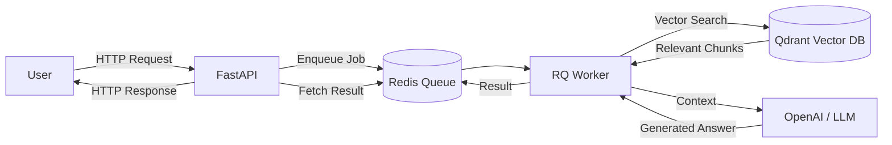

# FastAPI RAG with Redis Queue (RQ)

A **distributed Retrieval-Augmented Generation (RAG)** system built using **FastAPI**, **LangChain**, **Qdrant**, and **Redis Queue (RQ)**.

This project demonstrates how to handle RAG queries asynchronously using a background worker, making it scalable and production-ready.

---

## 🚀 Features

- PDF document ingestion and vector indexing
- Semantic search using Qdrant
- Asynchronous query processing with Redis Queue (RQ)
- FastAPI-based REST API
- Background workers for retrieval & generation
- Clean, modular architecture

---

## 🧱 Tech Stack

- **Python 3.9+**
- **FastAPI**
- **LangChain**
- **Qdrant (Vector Database)**
- **Redis + RQ**
- **OpenAI Embeddings**
- **Docker**

---

## 📂 Project Structure

```bash
distributed-rag-system/
├── client/
│   └── rq_client.py        # Redis + RQ configuration
├── queues/
│   └── worker.py           # RAG worker (retrieval + generation)
├── server.py               # FastAPI app
├── main.py                 # Entry point
├── index.py                # PDF ingestion & vector indexing
├── retrieve.py             # Local retrieval testing
├── requirements.txt
├── .env                    # API keys (ignored)
├── README.md
└── data/
    └── sample.pdf
```
## 📊 Architecture Diagram


## ⚙️ Setup Instructions
### 1️⃣ Clone the repository

```bash
git clone https://github.com/sourav-maji/distributed-rag-system.git

cd distributed-rag-system

```

### 2️⃣ Create virtual environment

```bash
python3 -m venv venv
source venv/bin/activate
```

### 3️⃣ Install dependencies
```bash
pip install --upgrade pip
pip install -r requirements.txt
```
### 4️⃣ Start Redis
```bash
docker run -p 6379:6379 redis
```
### 5️⃣ Start Qdrant
```bash
docker run -p 6333:6333 qdrant/qdrant
```
### Qdrant dashboard:

```bash
http://localhost:6333/dashboard
````
### 6️⃣ Configure Environment Variables
Create a .env file:
```env
OPENAI_API_KEY=your_openai_api_key
```
### 📥 Index Documents
Add PDFs to the data/ folder, then run:
```bash
python index.py
```

This will:
- Load PDF documents
- Split them into chunks
- Generate embeddings
- Store vectors in Qdrant

### 🔁 Start RQ Worker
Open a new terminal:
```
rq worker rag-queue
```
### 🚀 Start FastAPI Server

```
uvicorn rag_queue.server:app --reload
```
Server will be available at:
```
http://127.0.0.1:8000
```

## 🧠 How It Works
1. Documents are embedded and stored in Qdrant
2. User sends a query to FastAPI
3. Query is queued using Redis Queue (RQ)
4. Worker retrieves relevant chunks
5. LLM generates a context-aware response
6. Result is returned asynchronously

## 📌 Why RQ?
- Non-blocking API
- Simple distributed processing
- Easy horizontal scaling
- Better than synchronous RAG for production

## ⭐ Acknowledgements
- LangChain
- Qdrant
- Redis & RQ
- OpenAI